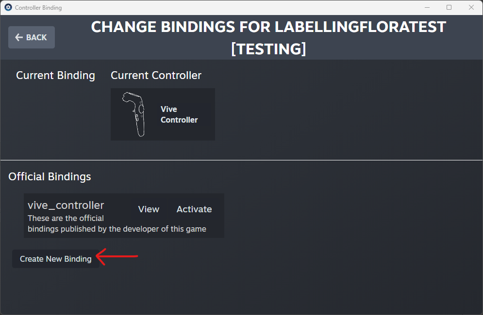

# Labelling Flora
This repository represents the official implementation of the paper "3D Dataset Generation Using Virtual Reality for Forest Biodiversity".
<br>Cyprien R. Fol, Nianfang Shi, Normand Overney, Arnadi Murtiyoso, Fabio Remondino, Verena C Griess.
<br>(c)2024 ETH Zurich, Cyprien Fol.

## Description
Labelling Flora is a novel approach based on the use of VR (Virtual reality) to bring ecological value to 3D point clouds.
<br />However, the proposed VR labelling method can be applied to any other 3D datasets requiring the association of semantic information such as AI (Artificial Intelligence) training dataset.

## System Requirement
Labelling Flora is a VR application, built and developed in **Unity 2020.3.12f1** together with **Visual Studio 2019** on **Windows 10**. 
<br />It has not been extensively tested with other Unity nor Visual Studio version. In case you face issues with your current version [Unity Hub](https://unity.com/unity-hub) might come in handy.

## Dependencies 
- [SteamVR 2.7.3](https://github.com/ValveSoftware/steamvr_unity_plugin/releases/tag/2.7.3)
- [OpenVR 1.1.4](https://github.com/ValveSoftware/unity-xr-plugin/releases)
- [LASzip.Net.dll](https://laszip.org/)
---  
## Installation
Follow these steps to set up and use the VR application for annotating point clouds.

### Step 1: Clone the Repository
Clone this repository to your local machine using the following command:

```bash
git clone <repository-url>
```

### Step 2: Create a Data Folder
In the cloned **Labelling Flora** repository, create a folder named **Data**.

### Step 3: Input Your Point Cloud
1. Download and unzip the folder [Single-tree Stem 3D Point Cloud](https://doi.org/10.3929/ethz-b-000694978) 
2. Place one of the HabitatTreeStem 3D point cloud .laz file in the **Data** folder.  

**Note: You can also use one of your own 3D point cloud but he file must meet the following criteria:**
- **File Format:** Must be either `.las` or `.laz`
- **Point Limit:** Maximum of **30 million points**

---
## Unity Setup
### Step 1: Start Steam and SteamVR
Make sure both **Steam** and **SteamVR** are running before you proceed. These are required to use the VR features in the app.

### Step 2: Open the Project in Unity
1. Launch **Unity 2020.3.12f1**.
2. Open the **Labelling Flora** project folder within Unity to load the project.
3. Open Folder **Scenes** and double clik **LabellingFlora.unity** scene

 
### Step 3: Locate the TreeStem GameObject
1.Go to the **Hierarchy** window.
2. Select the PointClouds->TreeStem GameObject


### Step 4: Configure PointCloudManager Settings
1. In the **Inspector** window, locate the **PointCloudManager** component attached to the GameObject.
2. Verify that the path parameters are correctly set.
3. Update the file name to match the point cloud file you added to the **Data** folder.  
**Important: Ensure the naming conventions are followed exactly:**
- Use the correct mix of lower-case and upper-case letters.
- Verify folder names are accurate.


### Step 5: Configure SteamVR Input
1. In Unity, go to **Window > SteamVR Input** and 


2. click "Open Binding UI".


3. In the Steam window, click **Create New Binding**.


4. You'll see your VR headset controllers displayed. Click on the **vrlabelling** button.

5. Click **Save Personal Binding** and then **Export Binding File**.


6. Close all the windows and return to Unity.

**NOTE: if you are not using the HTC Vive headset you will have have to manually assign each 10 functions to the corresponding buttons of your VR Headset.**

### Step 6: You’re Ready to Start Labelling!
Now you're all set to begin your labelling work.

---

## Running HoloFlora

### Step 1: Start Your VR Labelling Work
- Press the **Play** button in the Unity Editor to begin your VR labelling session.

### Step 2: Familiarize Yourself with the Labelling Commands
- Take a moment to get comfortable with the labelling commands and controls.


### Step 3: Double-Check Your Labelling
- Before saving your work, review all the layers at least once with the **left menu controller button**.

### Step 4: Save Your Point Cloud
1. Press the **Space Bar** of the keyboard to save your annotations on the point cloud.
2. Your point cloud will be saved in the `Data/Results` folder, with the same name as the original file but with a timestamp added.


3. To end the labelling session, press **Play** in Unity to stop the process.

### Step 5: Have Fun!
Enjoy your experience annotating with the VR app!

## Citation
Cite the Code: [](https://doi.org/10.5281/zenodo.13933004)

## Related Work
- [1] C.R. Fol, A. Murtiyoso, V. Griess, "[Feasibility study of using virtual reality for interactive and immersive semantic segmentation of single tree stems](https://doi.org/10.5194/isprs-archives-XLVIII-2-W1-2022-95-2022)"
- [2] C.R. Fol, S. Nianfang, A. Murtiyoso, V. Griess, "[Dataset for the article: "3D Dataset Generation Using Virtual Reality for Forest Biodiversity"](https://doi.org/10.3929/ethz-b-000694978)


### Acknowledgment
Acknowledgement to Syed Hussain Abbas, Nianfang Shi, Michelle Weber and Normand Overney

### License
This work is licensed under a Creative Commons Attribution 4.0 International license (CC-BY) (as defined in the [LICENSE](LICENSE.md)).
By downloading and using the code and model you agree to the terms in the [LICENSE](LICENSE.md).

